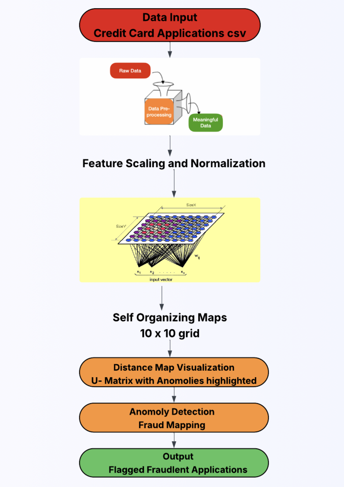

# Self-Organizing Maps (SOMs) – Exploratory Analysis & Clustering

This project demonstrates how **Self-Organizing Maps (SOMs)** can be used for unsupervised clustering and visualization of high-dimensional data. It provides a practical implementation of SOMs using MiniSom and includes data preprocessing, SOM training, visualizations, and cluster interpretation.

## Project Highlights

- Data Preprocessing for normalization and dimensionality compatibility  
- Implementation of **MiniSom** to train a Self-Organizing Map  
- Visualization of distance maps (U-Matrix) for understanding neighborhood clustering  
- Cluster interpretation with heatmaps and component planes  
- Final label assignment based on the trained SOM  

---



---

## Folder Structure

```
Self-Organizing-Maps
├── Self Organizing Maps (SOMs).ipynb  ← Main notebook
├── Dataset - Credit_Card_Applications.xls
└── README.md
```

---

## Tech Stack

- Python 3.x  
- [MiniSom](https://github.com/JustGlowing/minisom)  
- NumPy, Matplotlib, Pandas, Seaborn  
- Jupyter Notebook

---

## How to Run

1. Clone the repository:
   ```bash
   git clone https://github.com/yourusername/Self-Organizing-Maps.git
   cd Self-Organizing-Maps
   ```

2. Open the notebook:
   ```bash
   jupyter notebook "Self Organizing Maps (SOMs).ipynb"
   ```

---

## Sample Output

- U-Matrix visualizations to analyze clusters
- Label overlays on SOM grids
- Component planes for feature-level insights


---

## Author

**ManiDatta**  
Data Science @ University of Colorado Boulder  
[GitHub](https://github.com/Manidatta1)
